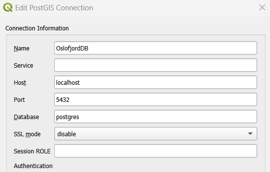

# OslofjordDB-API
OslofjordDB-API

Consists of five containers, one for the DB, one for Hasura, one for Apache Jena Fuseki, one for Grasp and one running a script only at startup.

## Installation
Here I will explain step by step how to install the docker container with some data in the database.

1. Install docker desktop
2. Pull this repository
3. `cd` into `OslofjordDB-API`
4. Now you need to add the txt files containing the salinity and turbidity data to the txt_files folder. Currently it only support the salinity and turbidity data. The data files can be found on the google drive or in educloud. 
5. Now we can run the first python script to convert the txt files to csv files and generate the SQL file that inserts the data. Run the following code:  
` python3 db/scripts/dataToCsv_postgre.py `

6. Before we build the docker image it can be smart to change the password in the Docker compose-file. The password will later be used to connect to the database.
7. Run `docker compose up -d` to start the containers in a detached state. 
To check that the containers are up and running, you can run `docker ps`.

After starting you can reach the following services:
- Hasura can be reached at http://localhost:8080 (for playing around with graphql on our data).
- Apache Jena Fuseki can be reached at http://localhost:3030

## Get started with the API
Since GraphQL is a self-documenting query language, it can be explored directly in the GraphiQL-playground available at http://localhost:8080. I would recommend exploring the use of the API through this interactive playground.

### API documentation
Documentation to all fields and subfields can be found in the "Docs"-page found at the top right in the GraphiQL-IDE. These docs includes comments and documentation that can help forming queries and mutations. More information on how to fully leverage the GraphiQL-IDE can be found here: https://github.com/graphql/graphiql/tree/main/packages/graphiql#readme

### GraphQL API endpoint: 
`http://localhost:8080/v1/graphql`
Documentation on how GraphQL is served over HTTP can be found here: https://graphql.org/learn/serving-over-http/

### Request headers
| Key | Value | Required / Recommended |
| --- | ---   | ---       | 
| Content-Type | application/json | Required |
| x-hasura-admin-secret | {$x-hasura-admin-secret} (set in the Docker compose-file) | Required |
| Accept-Encoding | gzip | Recommended |

For more information about how to explore the data using GraphQL, I would recommend checking out Hasura's own documentation:
- Queries: https://hasura.io/docs/latest/queries/overview/
- Mutations: https://hasura.io/docs/latest/mutations/overview/
- Subscriptions: https://hasura.io/docs/latest/subscriptions/overview/

## DB manager

You can also connect to the database using another database manager. E.g. QGIS or DBeaver.

To connect you insert:
- host: "localhost"
- port: "5432"
- database: "postgres" 

You will also need to insert username and password when prompted. 
- Username: "postgres"
The password is stored in the compose-file. If you did not change it, just use the standard password that was already written in the file.  

